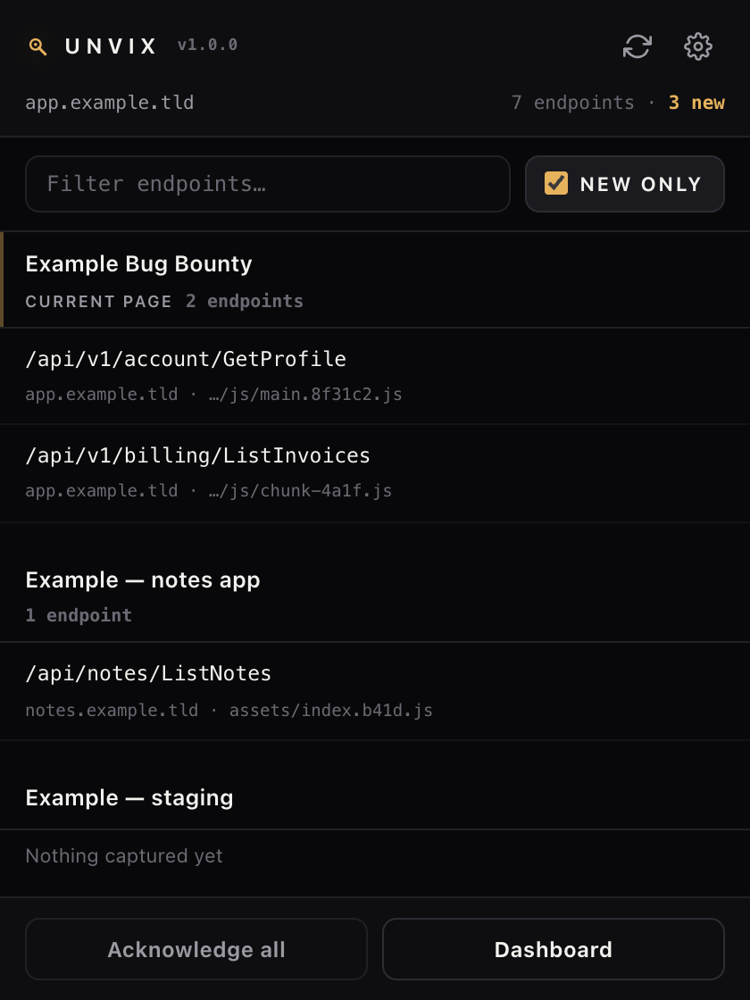
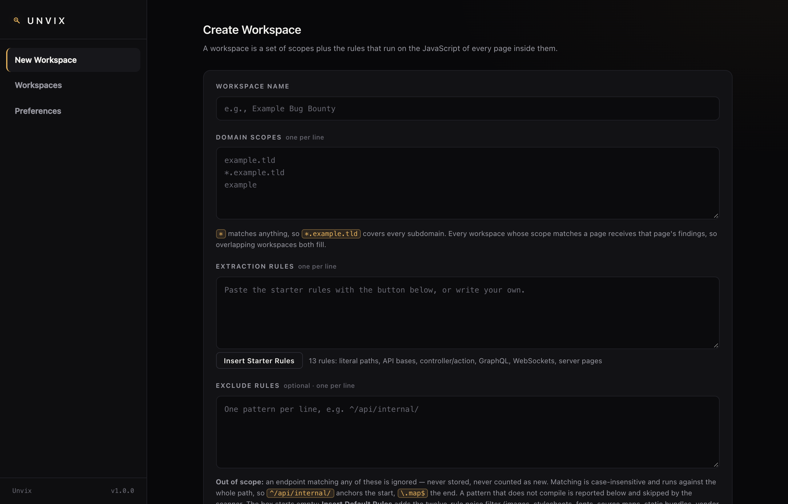
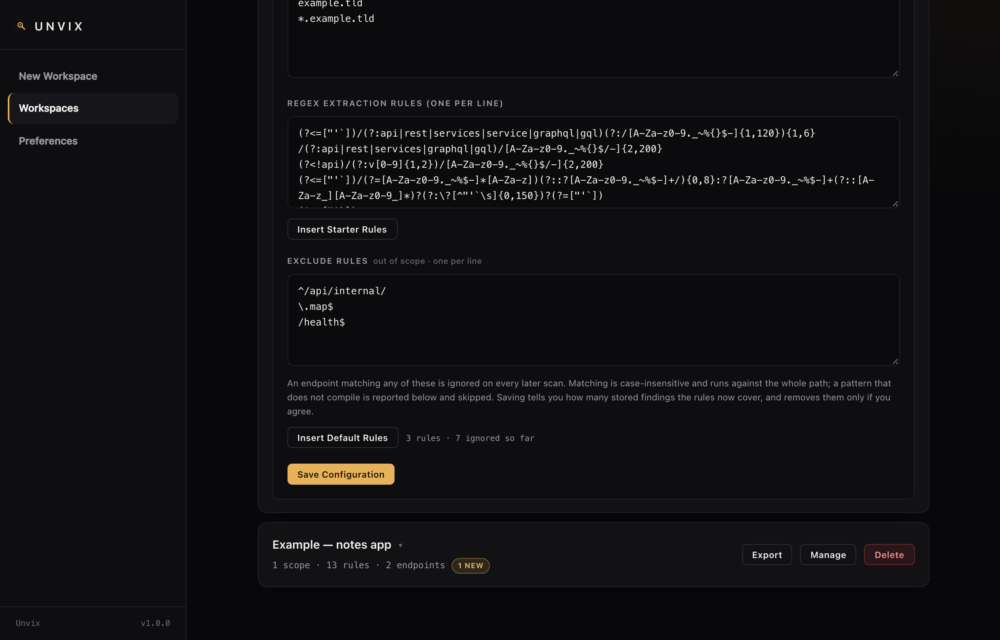

<div align="center">

# Unvix

**Unveil new endpoints. Discover new features.**

A Chrome extension for passive JavaScript recon: it reads the scripts a site
already loads, extracts the API endpoints and routes out of them with rules you
control, and marks anything new on your next visit.

No accounts · no telemetry · no server — everything stays in your browser.



</div>

## Install

1. Clone this repository.
2. `chrome://extensions` → **Developer mode** → **Load unpacked** → this folder.
3. Refresh the tabs you already had open. Chrome invalidates the content scripts
   of open tabs; that is true of every MV3 extension.

## Quick start

1. **New Workspace** — name it, then give it the scopes you are allowed to test:

   ```
   example.tld
   *.example.tld
   ```

2. **Insert Starter Rules** under *Extraction Rules* — 13 rules covering API
   paths, bases, controller/action pairs, GraphQL, WebSockets and SPA route
   tables.
3. Browse the target. The popup shows what is new for the page you are on, and
   the toolbar badge counts what you have not acknowledged yet.

| Create a workspace | Rules and exclusions |
|---|---|
|  |  |

## What it does

- **Endpoint discovery** — literal paths, API bases, GraphQL operations,
  WebSocket URLs, SPA route tables, absolute URLs, server-rendered pages.
- **NEW flags** — an endpoint that was not in an earlier scan is flagged, and the
  badge counts the unacknowledged ones.
- **Complete within scope** — it follows the chunks a bundle *declares*, so
  endpoints behind routes you never opened are found too.
- **Exclude rules** — out-of-scope patterns per workspace (internal APIs, health
  probes, assets): anything matching one is dropped before it is stored.
- **Export / import** — one workspace or everything, as JSON.

A scan of a real app can flag thirty endpoints at once. The list stays quiet: one
hairline and one dot per new row, and the count written once.

## Why the list is as complete as it is

- **Chunks are read out of the code that did load.** A webpack chunk map, Vite's
  `__vite__mapDeps`, a dynamic `import()`, `importScripts()`, a worker URL, a
  plain `"chunk-4a1f.js"` literal — every script the bundles name is fetched, so
  endpoints behind routes you never visited still show up.
- **Nothing is lost to the resource buffer.** Chrome keeps only the last 250
  resource-timing entries, so early bundles are evicted before a scan can see
  them. That is why a page often yields more endpoints with DevTools open
  (DevTools lifts the limit). Unvix raises the buffer itself at `document_start`
  and re-reads it, so the result does not depend on DevTools.
- **Late and inline scripts are included.** A `MutationObserver` catches scripts
  injected after load, module preloads and import maps are read, and inline
  `<script>` text is scanned as-is — it has no URL to fetch.
- **Only the target's own JavaScript is read.** A file counts when a workspace
  that matched the page is also scoped to the file's host, so a page on
  `example.com` cannot feed you endpoints out of someone else's script.

Bounded on purpose: same-origin per bundle, 1500 scripts per page, 25 s per scan,
and a byte cap on what is held in memory.

## Exclude rules (out of scope)

Anything matching one of these is ignored before it is stored, so it never
reaches the list, the counts or the badge. **Insert Default Rules** writes a
12-rule noise filter (images, stylesheets, fonts, source maps, built bundles,
vendor paths, health probes); the box itself starts empty.

```
^/api/internal/     # everything under an internal prefix
\.map$              # source maps
/health$            # health probes
```

- Matching is case-insensitive and runs against the whole path — anchor when you
  mean it: `^` for the start, `$` for the end.
- A pattern that will not compile is named next to the box and skipped by the
  scanner; one bad line can never empty a scan.
- The status line counts what the rules are doing (`3 rules · 7 ignored so far`),
  and saving tells you how many **stored** findings the new rules cover before
  anything is deleted. **Cancel changes nothing at all.**
- Exclude rules travel with the workspace, so they are in both export formats.

## Scope matching

A scope decides which pages feed a workspace and which of their files are read.
Only the host — plus the path, if you wrote one — is compared; the query string
and the fragment never take part.

```
scope: example.com
  https://example.com/                       match
  https://app.example.com/static/js/main.js   match   (a subdomain)
  https://example.com:8443/x.js               match   (ports are not normalised away)
  https://randomsite.com/?url=example.com     no      the query is not the scope
  https://example.com.evil.com/main.js        no      a dotted scope matches whole labels
```

`*` is a wildcard (`*.example.com`, `*://example.com/*`), matching is
case-insensitive, a leading scheme is ignored, and a malformed pattern matches
nothing instead of throwing. The popup and the scanner use the same rule, so a
workspace marked **current page** is always one the scanner really feeds.

## Privacy

- Nothing is sent anywhere: no analytics, no remote config, no third-party code.
- Fetches happen in your browser, from your own session, to hosts you scoped.
- Findings, workspaces and settings live in `chrome.storage.local`, and leave it
  only when you export them.
- Unvix is **passive**: it reads the JavaScript the page already loaded. It does
  not fuzz, brute-force, or send anything to the target.

Use it only on assets you are authorised to test.

## Files

```
manifest.json          MV3 manifest — no remote code, no background page
background.js          fetch + extract (service worker)
content.js             script harvesting (DOM, Performance API, MutationObserver)
regex-pack.txt         starter extraction rules, source of truth
exclude-pack.txt       default out-of-scope rules, source of truth
build-regex-pack.js    regenerates ui/{regex,exclude}-pack.js from the .txt files
icons/                 icon.svg + 16/32/48/128 PNGs
ui/theme.css           shared dark theme (no remote fonts or assets)
ui/page-scope.js       scope matching + "current page first" ordering for the popup
ui/options.{html,js}   workspaces, rules, filters, settings, import/export
ui/popup.{html,js}     findings list, NEW-only filter, rescan, acknowledge
docs/                  screenshots and the social preview card
```

After editing either pack, run `node build-regex-pack.js`. It refuses to emit an
extraction rule that fails to compile or can match `""` (with the `/g` flag such
a match never advances `lastIndex`, which would hang the scanner), and an exclude
rule that fails to compile.

**Every extraction rule runs with the `gi` flags**, so `[A-Z]` and `[a-z]` are
the same thing — write patterns accordingly, case-sensitivity is not available.

## Development

The CDP-driven regression suites (popup layout contract, scope table, scope
isolation, exclude rules, discovery completeness) are deliberately kept outside
this folder: an unpacked extension should contain only the extension.

## Contributing

Issues and pull requests are welcome. Please keep the storage schema
(`targets` / `discovered` / `cache` / `apiBases` / `settings`), the
`[path, timestamp, isNew, sourceUrl]` tuple and the import/export formats
backwards compatible — existing workspaces have to keep working.
